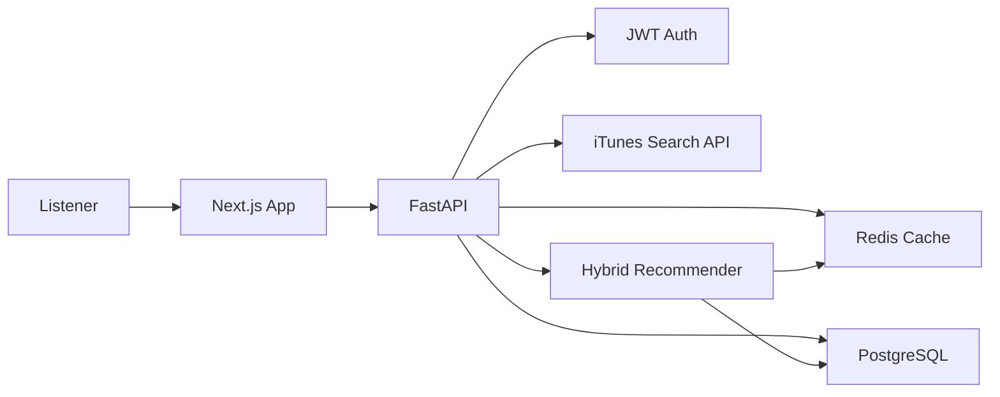

# Resonance AI Music Platform

Resonance is a production-oriented AI music recommendation platform built with Next.js, FastAPI, PostgreSQL, Redis, JWT authentication, and a hybrid Python recommendation engine. It uses the iTunes Search API for real preview audio, album art, artist metadata, and searchable music content.

## What Is Included

- Premium streaming-style Next.js interface with search, audio preview playback, favorites, playlists, queue, social activity, and admin analytics.
- FastAPI backend with JWT auth, iTunes proxy/search, user behavior tracking, playlist collaboration, recommendations, and admin metrics.
- PostgreSQL schema covering users, songs, listening history, favorites, playlists, members, moods, locations, recommendations, sessions, analytics, and friend activity.
- Redis caching for iTunes responses and hot recommendation payloads.
- Hybrid recommender using content scoring, collaborative signals, behavior scores, trending injection, time-aware boosts, mood matching, location mapping, weather, and festival context.
- Docker Compose for local Postgres, Redis, API, and web services.

## Quick Start

1. Copy environment variables.

```powershell
Copy-Item .env.example .env
```

2. Start infrastructure and services.

```powershell
docker compose up --build
```

3. Open the app.

- Web: http://localhost:3000
- API docs: http://localhost:8000/docs

## Local Development Without Docker

Backend:

```powershell
cd services/api
python -m venv .venv
.\.venv\Scripts\Activate.ps1
pip install -r requirements.txt
uvicorn app.main:app --reload --port 8000
```

Frontend:

```powershell
cd apps/web
npm install
npm run dev
```

## Architecture



## Recommendation Strategy

The ranking pipeline blends:

1. Content-based genre, artist, mood, and metadata similarity.
2. Collaborative signals from users with overlapping favorites, playlist saves, and plays.
3. Behavioral scoring from plays, skips, replays, likes, dislikes, search, session time, and saves.
4. Trending injection by region and global activity.
5. Time-aware ranking for morning, afternoon, evening, and night patterns.
6. Mood matching for Happy, Sad, Gym, Party, Relaxed, Romantic, Focus, and Angry.
7. Context boosts for weather and festivals.

## Resume Pitch

Built a scalable AI-powered music platform with a modern streaming UI, JWT-secured FastAPI backend, PostgreSQL event schema, Redis caching, iTunes API ingestion, collaborative playlist features, analytics dashboard, and a hybrid recommendation engine that personalizes by mood, location, time, weather, and user behavior.
